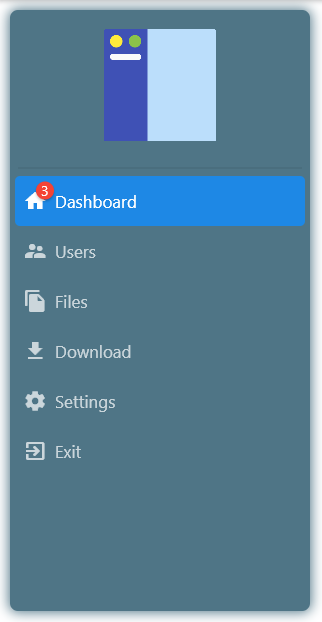

<div align="center" style="text-align:center">
<h1 align="center">Easy Sidemenu</h1>

</br>
<a href="https://github.com/Jamalianpour/easy_sidemenu/license">
    
</a>
<a href="https://pub.dev/packages/easy_sidemenu">
      
</a>
<a>
    
</a>
</div>

Easy sidemenu is An easy to use side menu (bar) for flutter that you can use for navigations in your application.

Sidemenu is a menu that is usually located on the left or right of the page and can used for navigations or other things.
Sidemenu is similar to bottom navigation bar but in the side of screen and usually used for larger screens.

## Screenshots

| Open                             | Compact                             |
| -------------------------------- | ----------------------------------- |
|  |  |

| Auto                              |
| --------------------------------- |
|  |

## Demo

You can see web demo here: [https://jamalianpour.github.io/easy_sidemenu](https://jamalianpour.github.io/easy_sidemenu)

## Usage

##### 1. add dependencies into you project pubspec.yaml file

```yaml
dependencies:
  easy_sidemenu: ^0.2.1
```

Run `flutter packages get` in the root directory of your app.

##### 2. import easy sidemenu lib

```dart
import 'package:easy_sidemenu/easy_sidemenu.dart';
```

Now you can use `SideMenu` as a widget in your code.

##### 3. use SideMenu

At first you should defind a list of item that will displayed on `SideMenu`:

```dart
List<SideMenuItem> items = [
  SideMenuItem(
    // Priority of item to show on SideMenu, lower value is displayed at the top
    priority: 0,
    title: 'Dashboard',
    onTap: () => page.jumpToPage(0),
    icon: Icon(Icons.home),
    badgeContent: Text(
      '3',
      style: TextStyle(color: Colors.white),
    ),
  ),
  SideMenuItem(
    priority: 1,
    title: 'Settings',
    onTap: () => page.jumpToPage(1),
    icon: Icon(Icons.settings),
  ),
  SideMenuItem(
    priority: 2,
    title: 'Exit',
    onTap: () {},
    icon: Icon(Icons.exit_to_app),
  ),
];
```

###### priority rule:

- Priority should start from 0
- Priority value should be unique

After that you need to warp your main page to a `row` and then add `SideMenu` as first child of that, like below:

```dart
PageController page = PageController();
Row(
  mainAxisAlignment: MainAxisAlignment.start,
  children: [
    SideMenu(
      // page controller to manage a PageView
      controller: page,
      // will shows on top of all items, it can be a logo or a Title text
      title: Image.asset('assets/images/easy_sidemenu.png'),
      // will show on bottom of SideMenu when displayMode was SideMenuDisplayMode.open
      footer: Text('demo'),
      // List of SideMenuItem to show them on SideMenu
      items: items,
    ),
    Expanded(
      child: PageView(
        controller: page,
        children: [
          Container(
            child: Center(
              child: Text('Dashboard'),
            ),
          ),
          Container(
            child: Center(
              child: Text('Settings'),
            ),
          ),
        ],
      ),
    ),
  ],
),
```

### Style

you can change style of side menu with `SideMenuStyle` :

```dart
style: SideMenuStyle(
  displayMode: SideMenuDisplayMode.auto,
  decoration: BoxDecoration(),
  openSideMenuWidth: 200,
  compactSideMenuWidth: 40,
  hoverColor: Colors.blue[100],
  selectedColor: Colors.lightBlue,
  selectedIconColor: Colors.white,
  unselectedIconColor: Colors.black54,
  backgroundColor: Colors.grey
  selectedTitleTextStyle: TextStyle(color: Colors.white),
  unselectedTitleTextStyle: TextStyle(color: Colors.black54),
  iconSize: 20,
),
```

#### Example style

<details>
<summary>Code</summary>

```dart
style: SideMenuStyle(
  displayMode: SideMenuDisplayMode.auto,
  hoverColor: Colors.blue[100],
  selectedColor: Colors.blue[600],
  selectedTitleTextStyle: TextStyle(color: Colors.white),
  selectedIconColor: Colors.white,
  unselectedIconColor: Colors.white70,
  unselectedTitleTextStyle: TextStyle(color: Colors.white70),
  decoration: BoxDecoration(
      borderRadius: BorderRadius.all(Radius.circular(8)),
      boxShadow: [
        BoxShadow(
          color: Color.fromARGB(255, 79, 117, 134),
          spreadRadius: 1,
          blurRadius: 10,
          offset: Offset(0, 0), // changes position of shadow
        ),
      ]),
  backgroundColor: Color.fromARGB(255, 79, 117, 134)
  // openSideMenuWidth: 200
),
```

</details>



#### Style Props

| props                    |         types          |                                   description                                   |
| :----------------------- | :--------------------: | :-----------------------------------------------------------------------------: |
| displayMode              | `SideMenuDisplayMode?` | SideMenuDisplayMode.auto, SideMenuDisplayMode.open, SideMenuDisplayMode.compact |
| decoration               |    `BoxDecoration?`    |                 Decoration of `SideMenu` background (container)                 |
| openSideMenuWidth        |       `double?`        |        Width of `SideMenu` when displayMode was SideMenuDisplayMode.open        |
| compactSideMenuWidth     |       `double?`        |      Width of `SideMenu` when displayMode was SideMenuDisplayMode.compact       |
| hoverColor               |        `Color?`        |                Color of `SideMenuItem` when mouse hover on that                 |
| selectedColor            |        `Color?`        |            Background color of `SideMenuItem` when item is selected             |
| selectedIconColor        |        `Color?`        |                       Color of icon when item is selected                       |
| unselectedIconColor      |        `Color?`        |                      Color of icon when item is unselected                      |
| backgroundColor          |        `Color?`        |                         Background color of `SideMenu`                          |
| selectedTitleTextStyle   |      `TextStyle?`      |                   Style of `title` text when item is selected                   |
| unselectedTitleTextStyle |      `TextStyle?`      |                  Style of `title` text when item is unselected                  |
| iconSize                 |       `double?`        |                         Size of icon on `SideMenuItem`                          |

---

Feel free to fork this repository and send pull request 🏁👍
